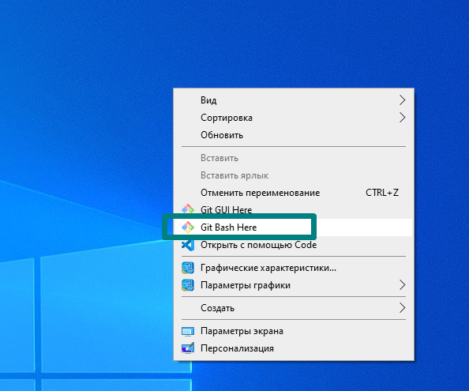
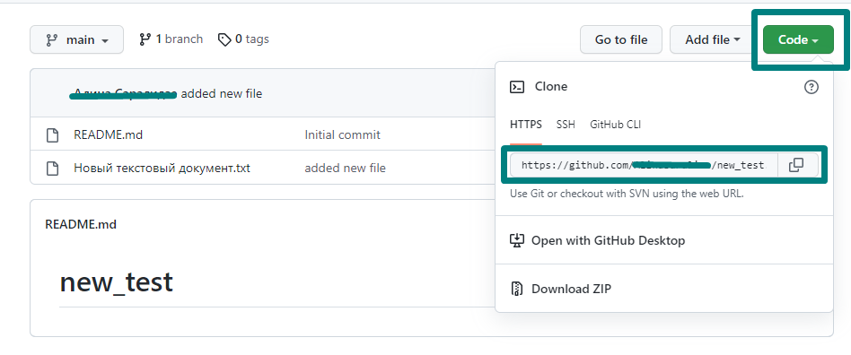

[К содержанию](./readme.md)

## Команды git. Клонирование. Добавление файла
___
После создания репозитория в удаленном сервере (каковым и является github), Вы можете перенести свой директорий на собственный компьютер. 

Для этого Вам понадобится заранее скачать программу **Git Bash** (для Windows) и в папке, которая будет служить для Вас рабочим пространством (где будут храниться файлы для проекта) правой кнопкой мы можем вызвать открытие терминала:

Любая команда стартует со слова **git**. Первое, что Вам необходимо сделать - перенести свой директорий из удаленного узла в локальный, то есть, клонировать в своем компьютере:

- `git clone https://здесь_ссылка_на_репозиторий.git`

С помощью ссылки под кнопкой **Code** в github Вы можете дать своему компьютеру команду клонировать репозиторий:

- `git init` - создает поддиректорий в Вашем директории. По сути, создает новый пустой репозиторий.

- `git config` - прежде чем вносить что-то в Ваш репозиторий, проверьте его параметры;)

- `git add [файл]` - одна из самых важных команд в git. Позволяет Вам добавить в репозиторий файл с изменениями, например, код нового фунционала в Вашей программе. В квадратных скобках указывается путь к файлу в локальном хранилище. 

Далее в отдельной статье мы рассмотрим такие команды как git commit, git merge и другие.

[Далее>>](./git_commands_2.md "git_commit и git_merge")
