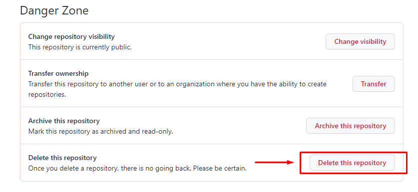

[К содержанию](./readme.md)

## Состояние репозитория. Его удаление
___
Для получения сведений о статусе репозитория используется три команды:
+ `git status` - позволяет отследить изменения в репозитории (что нужно добавить, а что можно исключить);
+ `git log` - список последних коммитов и их хэш SHA1. Список выводится, начиная с последнего коммита.
+ `git show[хэш]` - раскрывает информацию об определенном коммите. Хэш, который мы извлекли из предыдущей команды, указывается после команды в квадратных скобках.

Это основы, которые необходимо знать о GIT, чтобы успешно вести проект в Github и регистрировать изменения. 
Если же Вы решили добавить локально удаленный репозиторий, то это можно сделать с помощью команды `git remote add [имя удаленного репозитория][его адрес]`. Во многом эта команда может напомнить `git clone`, но есть существенная разница. В случае с `git remote add` файлы из удаленного репозитория <u>не создаются на локальном сервере физически</u>. Тогда как `git clone` полностью копирует существующий репозиторий, в том числе создает такие же файлы на Вашем компьютере.

Удалить репозиторий с помощью команды невозможно. Для этого необходимо войти на свою страницу на сайте github и во вкладке настроек (Settings) в самом низу страницы нажать Delete this repository:

### В заключении хочу пожелать удачи в работе над любыми проектами. Интересной работы вместе с GIT!