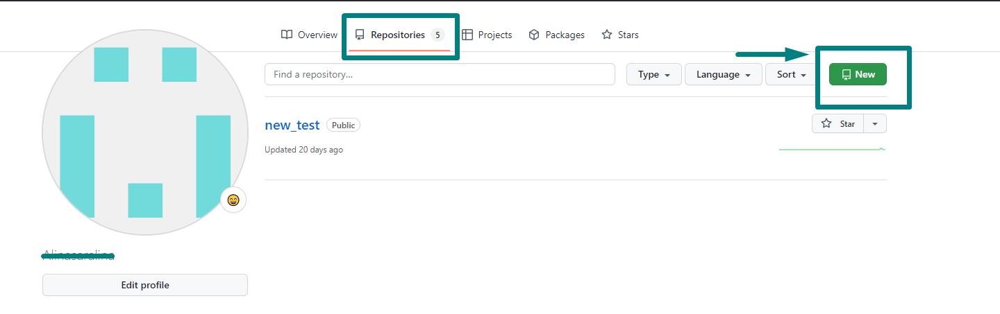

[К содержанию](./readme.md)

## Создание репозитория в Github
___

Создать новый репозиторий мы можем через интерфейс, авторизовавшись на платформе [Github](https://github.com/).
Для этого во вкладке Repositories необходимо нажать кнопку New:

### В Github откроется окно, которое предлагает:
- дать имя новому проекту;
- обозначить, будет ли репозиторий публичным (доступным всем пользователям) или только Вам и избранному кругу лиц;
+ добавить файлы README и .gitignore

**Название** - может быть любым, но хорошим тоном среди программистов считается использование латиницы и/или английского языка.

__Публичным__ по умолчанию создается репозиторий, в котором Вам нечего скрывать от других пользователей Github, например, если создаваемый проект не является коммерческим.

**README.md** - обязательный файл для описания проекта. Его отсутствие в репозитории считается плохой практикой. Такой файл всегда имеет одно название, не подлежит переименованию и всегда хранится с раширением .md (файл разметки Markdown).

__В файл с расширением .gitignore__ можно поместить список любых файлов в Вашем репозитории, которые Вы не хотите использовать и изменять в работе; также Вы можете указать расширение таких файлов или часть их наименования, чтобы обобщить выборку:

<table>
  <tr>
    <th>Что добавляем?</th>
    <th>Обозначение/символ</th>
    <th>Пример</th>
  </tr>
  <tr>
    <td>Написать комментарий</td>
    <td>#</td>
    <td>#ignore local files</td>
  </tr>
  <tr>
    <td>Применить  <u>только</u> к файлам и каталогам из хранилища, где хранится .gitignore
     </td>
    <td>/ (в начале строки)</td>
    <td>/folder</td>
  </tr>
  <tr>
    <td>Заменить символ</td>
    <td>?</td>
    <td>code/show.sw?</td>
  </tr>
    <tr>
    <td>Заменить все символы</td>
    <td>*</td>
    <td>*.png - игнорируем все файлы с расширением .png</td>
  </tr>
  <td>Указание подкаталогов (чтобы не перечислять весь путь)</td>
    <td>**</td>
    <td>doc/**/*.txt - игнорируем все .txt файлы в каталоге doc и его подкаталогах</td>
  </tr>
  <tr>
    <td>Инвертировать правило</td>
    <td>! (в начале строки)</td>
    <td>! git.png - игнорируем все файлы png, кроме файла git</td>
  </tr>
  <td>Разделение уровня каталогов</td>
    <td>/</td>
    <td>build/broken - игнорируем все в подкаталоге broken каталога build</td>
  </tr>
</table>

[Далее>>](/git_commands.md "Команды git")